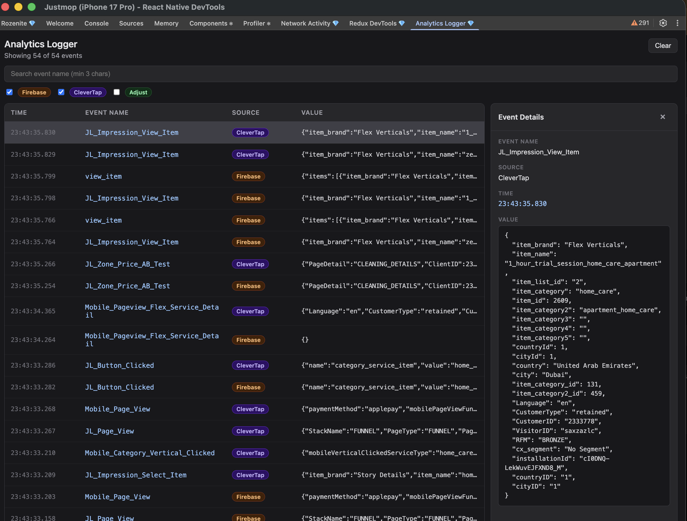

# rozenite-analytics-devtools

Rozenite devtools panel for monitoring analytics events from Firebase, CleverTap, and Adjust in React Native.



## Features

- Real-time analytics event logging in Rozenite devtools
- Supports **Firebase Analytics**, **CleverTap**, and **Adjust**
- Filter events by source and search by event name
- Inspect event details (name, source, time, formatted params) in a side panel

## Installation

Install directly from GitHub:

```bash
npm install github:yakupdurmus/rozenite-analytics-devtools.git
```

Or add it to your `package.json`:

```json
{
  "dependencies": {
    "rozenite-analytics-devtools": "github:yakupdurmus/rozenite-analytics-devtools.git"
  }
}
```

Then run:

```bash
npm install
```

### Peer dependencies

Install the analytics SDKs you use in your app. All are optional — only installed packages are intercepted:

```bash
npm install @react-native-firebase/analytics   # Firebase
npm install clevertap-react-native               # CleverTap
npm install react-native-adjust                  # Adjust
```

## Usage

Register the plugin in your Rozenite devtools setup:

```tsx
import { useAnalyticsLoggerDevTools } from 'rozenite-analytics-devtools';

const RozenitePlugins = () => {
  useAnalyticsLoggerDevTools();

  return null;
};

export default RozenitePlugins;
```

Mount `RozenitePlugins` in your app root. In development, open Rozenite devtools and select the **Analytics Logger** panel to view incoming events.

## How it works

In development, `useAnalyticsLoggerDevTools` patches the analytics SDKs you have installed and forwards each `logEvent` / `recordEvent` / `trackEvent` call to the devtools panel. Original SDK behavior is preserved — events are still sent to Firebase, CleverTap, and Adjust as usual.

## License

MIT
